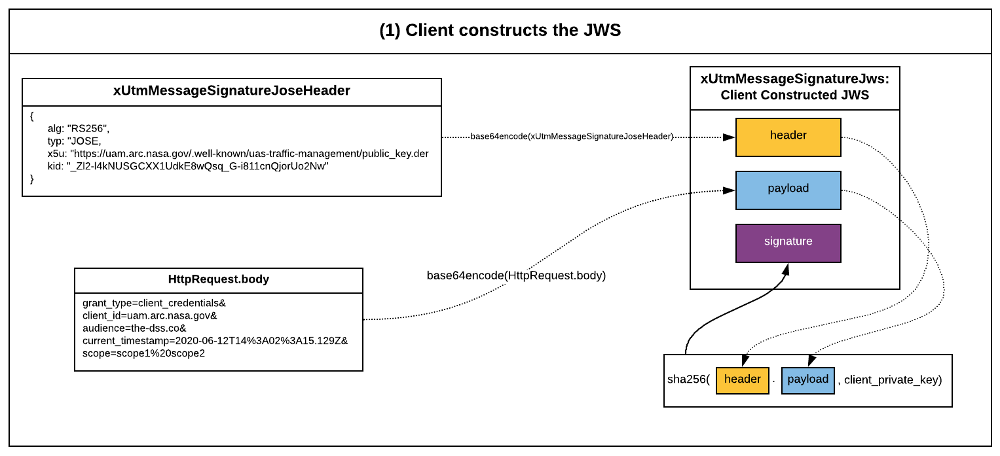
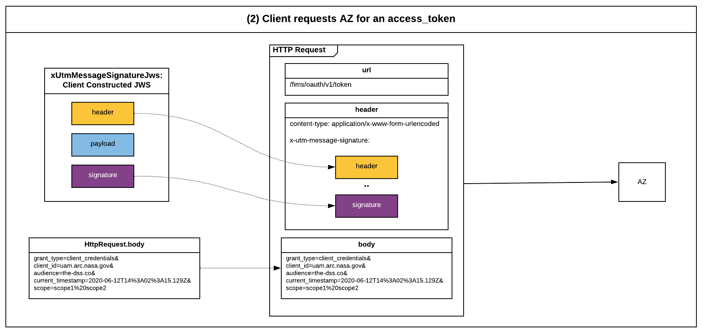
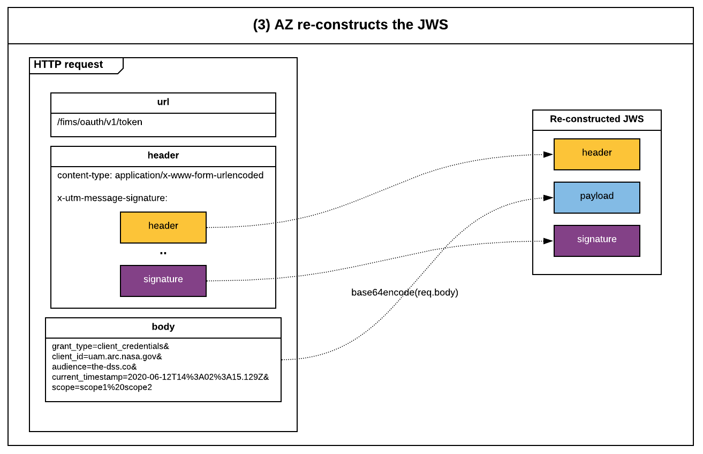
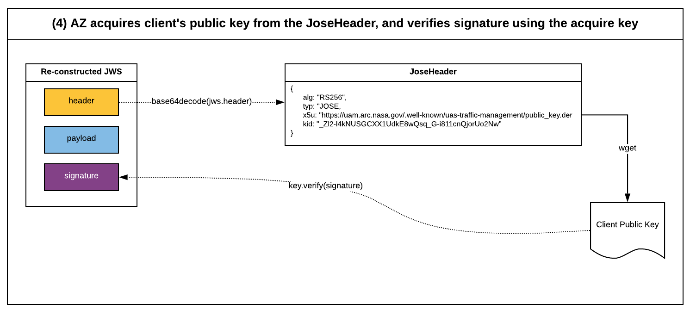
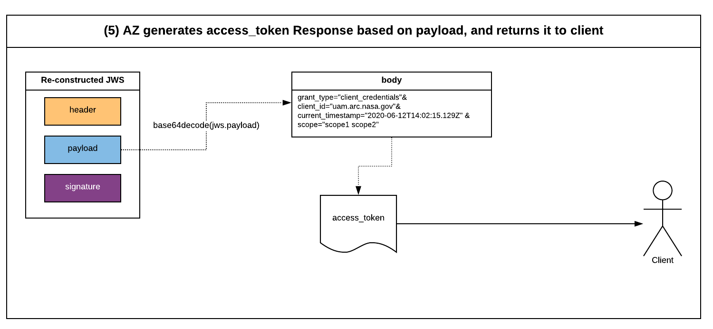

# FIMS Authorization Server (FIMS-Authz) with Signature Authentication
This API provides an oauth2 token and other endpoints for the FIMS Authorization Server. FIMS-Authz implements the API here https://github.com/nasa/utm-apis/blob/master/fimsauthz-api/fims-authz.yaml.  

## Message Signing and Signature Authentication

1. Client constructs a `xUtmMessageSignatureJws` -
   * Client generates a `xUtmMessageSignatureJoseHeader` with the relevant data and assigns it as the header of the `xUtmMessageSignatureJws`.
   * Client uses the same character string as the HTTP body and assigns it as the payload of the `xUtmMessageSignatureJws`.
   * Client constructs the `xUtmMessageSignatureJws` by base64 encoding the header and payload.
   * Client generated the signature of the `xUtmMessageSignatureJws` by calculating the SHA-256 hash of the concatenated header and payload, and it's private key for the hashing.
   * Client assigns the generated the signature as the signature of the `xUtmMessageSignatureJws`.

2. Client requests FIMS-AZ for an access_token

   * Client creates an HTTP request with the following configuration -
     * Request body must be the same character string as the one used for the `xUtmMessageSignatureJws`.
     * Request headers has a header called `x-utm-message-signature` which is formed by concatenating the `xUtmMessageSignatureJws`'s header and signature.

   * Clients sends this constructed request to FIMS-Authz

3. FIMS-Authz re-constructs the JWS

4. FIMS-Authz Verifies the Signature

FIMS-Authz acquires client's public key from the JoseHeader, and verifies signature using the acquired key

5. FIMS-Authz generates response with token

# Roles and Scopes
[./nup-roles.yaml](./nup-roles.yaml) maps scopes to roles and provides example usages.

# Pseudo-Implementation

A pseudo-implementation for interfacing with FIMS-AZ has been documented here - [pseudo-client.md](./pseudo-client.md)

# References
* [RFC 6749: OAuth 2.0](https://tools.ietf.org/html/rfc6749)
* [RFC 6750: OAuth Bearer Token Usage](https://tools.ietf.org/html/rfc6750)
* [RFC 7523: JSON Web Token](https://tools.ietf.org/html/rfc7519)
* [RFC 7523: JSON Web Token Profile for OAuth](https://tools.ietf.org/html/rfc7523)
* [RFC 7515: JSON Web Signature](https://tools.ietf.org/html/rfc7515)
* [OAuth Server Metadata](https://tools.ietf.org/html/draft-ietf-oauth-discovery-06)
* [RFC 7662: OAuth Token Introspection](https://tools.ietf.org/html/rfc7662)
* [Java Cryptography Architecture: Standard Names](http://docs.oracle.com/javase/8/docs/technotes/guides/security/StandardNames.html)
