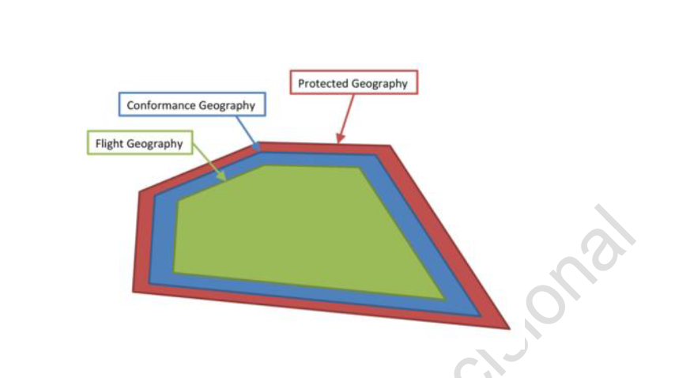

# NUSS-Operator Interface

The NUSS-Operator interface is defined by this README and theses OpenAPI specs. V2.1 OpenAPI spec is based on V2.1 data models and is defined in .  

## Conformance Monitoring
If an active operation violates its conformance geography, that operation is transitioned to the nonconforming state, and it could eventually be transitioned to
the rogue state.

NUSS defines additional regions around the flight volumes called conformance and protected volumes. The protected volume is used to strategically deconflict operations from each other as well as from airspace constraints.

Since the USS-API OperationVolume model defines validation requirements, the converted model needs to be validated before the first USS-API data exchange.

**Figure 1: Volumes of Flight, Conformance and Protected**

---

### Conformance Monitoring

When Operator submits submits an intention to fly to NUSS, NUSS defines that region as the Flight Geography.  NUSS expands that region into conformance and protected regions and maps the Operator geography into the UTM Commons geography.

The UTM Commons Operation Volume is used for Strategic Deconfliction.  The conversions from NUSS's Operator API's OperationVolume to UTM Commons Operation Volume is shown in Table 2.

---
utm-commons | Operator Volume
------------ | -------------
Operation Volume   | Protected Volume
not specified   | Conformance Volume
not specified   | Flight Volume

**Table 2: Mapping from Operator OperationVolume to UTM Commons**

---

Figure 2 lists default values for NUSS's conformance parameters. Theses defaults are bound at launch time. Additionally NUSS can bind conformance parameters at runtime; for example, conformance properties may be informed by an SDSP based on weather or surveillance findings.

The update rate for position reports is at least 1 Hz to no more than 5 Hz. In the case that there are too few reports per second, the UTM System will transition the operation to the NONCONFORMING state and notify the UAS Operator.

The conformance expand the operator's geography to a 4d conformance volume.  A position within this region will trigger an Active to Non-Conformant state change. Similarly the protected values expand the conformance geography to define the Operation Volume. If an operation breaches its assigned protected geography, it will immediately be transitioned to the ROGUE state.

minimum.altitude.feet is global to NUSS to define the a total minimum.

reportingFrequency.minimum.hz specifies the max interval between position reports. This interval will trigger Active to Non-conforming, and eventually to Rogue.

---

          reportingFrequency.minimum.hz:0.33
          minimum.altitude.feet:-250
          conformance.lateral.feet:30
          conformance.altitude.feet:20
          conformance.time.ms:60000
          protected.lateral.feet:60
          protected.altitude.feet:20
          protected.time.ms:60000

**Figure 2: Default Conformance Values**

## Operator Operation States

Operator-API Operation States are shown in Figure 1.  Note that Non-conforming to Closed is a valid state transition but is not captured this diagram.

**Figure 4: Operator-API Operation States**

Abbreviation | State
------------ | -------------
 P  | PROPOSED
 A  |  ACCEPTED
 R  | REJECTED - terminal
 C   | CLOSED  - terminal
 X   | CANCELED  - terminal
 I   | READIED
 E   | EXPIRED  - terminal
 G   | ROGUECLOSED  - terminal
 B   | ABORTCLOSED - terminal
 U  | ROGUE
 T  | ABORTING
 F  | NON-CONFORMING
 V  | ACTIVE

 **Table 2: Operator-API Operation State Abbreviations**
