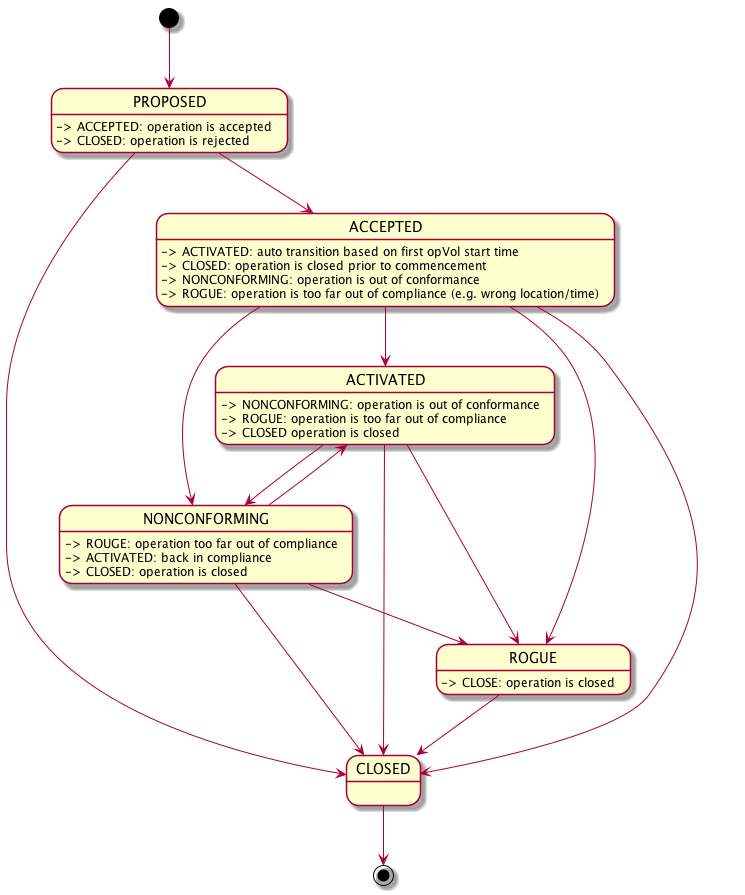
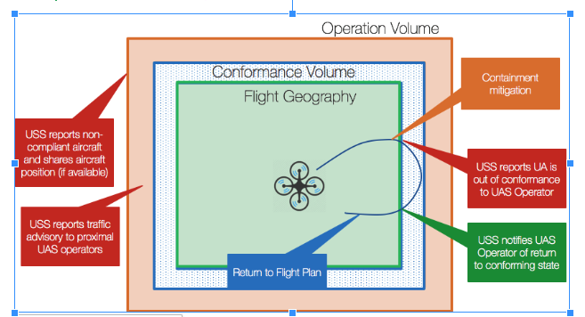

# V4 Operator API

The V2.1 API can be found here: 

## V4 Operator States

Operator-API Operation States are shown in Figure 1.

**Figure 1: Operator-API Operation States**

## Conformance

NUSS defines additional regions around the flight volumes called conformance and protected volumes. If an active operation violates its conformance geography, that operation is transitioned to the nonconforming state, and it could eventually be transitioned to the rogue state.  The protected volume is used to strategically deconflict operations from each other as well as from airspace constraints.

**Figure 2: Volumes of Flight, Conformance and Protected**

---

### Conformance Buffer Values

When Operator submits submits an intention to fly to NUSS, NUSS defines that region as the Flight Geography.  NUSS expands that region into conformance and protected regions and maps the Operator geography into the UTM Commons geography. The outermost volume is used for Strategic Deconfliction.  

Figure 3 lists default values for NUSS's conformance parameters. Theses defaults are bound at launch time. Additionally NUSS can bind conformance parameters at runtime; for example, conformance properties may be informed by an SDSP based on weather or surveillance findings.

The update rate for position reports is at least 1 Hz to no more than 5 Hz. In the case that there are too few reports per second, the NUSS will transition the operation to the NONCONFORMING state and notify the UAS Operator. If an operation breaches its assigned protected geography, it will immediately be transitioned to the ROGUE state.

minimum.altitude.feet is global to NUSS to define the a total minimum.

reportingFrequency.minimum.hz specifies the max interval between position reports. This interval will trigger Active to Non-conformat, and eventually Non-conformant to Rogue.

---

          reportingFrequency.minimum.hz
          minimum.altitude.feet:-250
          conformance.lateral.feet:30
          conformance.altitude.feet:20
          conformance.time.ms:60000
          protected.lateral.feet:60
          protected.altitude.feet:20
          protected.time.ms:60000

**Figure 3: Default Conformance Values**
